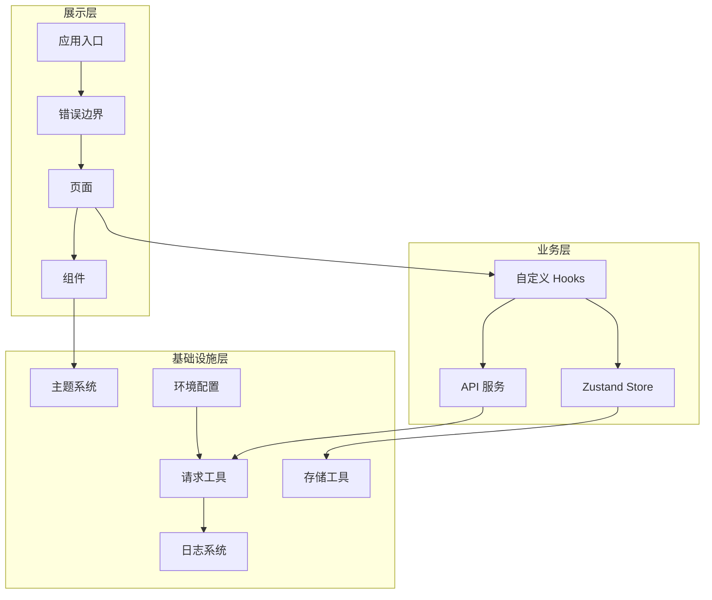

# 设计文档：架构改进

## 概述

本设计文档描述了 React Native 项目架构改进的技术方案，包括 API 服务层、错误边界、日志系统、主题系统和环境配置优化。这些改进将使项目达到企业级前端架构标准。

## 架构设计

### 整体架构图



### 目录结构

```
src/
├── app/                      # 应用入口
├── components/
│   ├── shared/               # [新增] 通用组件
│   │   ├── ErrorBoundary/    # 错误边界组件
│   │   └── index.ts
│   └── ...                   # 业务组件
├── services/                 # [新增] API 服务层
│   ├── types.ts              # 服务类型定义
│   ├── userService.ts        # 用户服务
│   ├── scanService.ts        # 扫描服务
│   └── index.ts              # 统一导出
├── theme/                    # [新增] 主题系统
│   ├── colors.ts             # 颜色定义
│   ├── spacing.ts            # 间距定义
│   ├── typography.ts         # 字体定义
│   ├── shadows.ts            # 阴影定义
│   ├── themes.ts             # 主题配置
│   ├── ThemeContext.tsx      # 主题上下文
│   ├── useTheme.ts           # 主题 Hook
│   └── index.ts              # 统一导出
├── utils/
│   ├── logger.ts             # [新增] 日志系统
│   ├── request.ts            # [修改] 集成日志
│   └── ...
├── common/
│   └── config.ts             # [修改] 环境配置优化
└── ...
```

## 组件和接口

### 1. API 服务层

#### 接口设计

```typescript
// src/services/types.ts
/** API 响应结构 */
export interface IApiResponse<T> {
  code: number;
  data: T;
  message: string;
}

/** 分页参数 */
export interface IPageParams {
  page: number;
  pageSize: number;
}

/** 分页响应 */
export interface IPageResponse<T> {
  list: T[];
  total: number;
  page: number;
  pageSize: number;
}
```

#### Service 模式

```typescript
// src/services/userService.ts
import { get, post } from '~/utils/request';
import type { IUserProfile } from '~/store';

/** 登录参数 */
export interface ILoginParams {
  username: string;
  password: string;
}

/** 登录响应 */
export interface ILoginResponse {
  token: string;
  user: IUserProfile;
}

/** 用户服务 */
export const userService = {
  /** 登录 */
  login: (params: ILoginParams) =>
    post<ILoginParams, ILoginResponse>({ url: '/auth/login', data: params }),

  /** 获取用户资料 */
  getProfile: () => get<void, IUserProfile>({ url: '/user/profile' }),

  /** 登出 */
  logout: () => post<void, void>({ url: '/auth/logout' }),
};
```

### 2. 错误边界

#### 组件接口

```typescript
// src/components/shared/ErrorBoundary/types.ts
/** 错误边界属性 */
export interface IErrorBoundaryProps {
  /** 子组件 */
  children: React.ReactNode;
  /** 自定义降级 UI */
  fallback?: React.ReactNode;
  /** 错误回调 */
  onError?: (error: Error, errorInfo: React.ErrorInfo) => void;
  /** 重试回调 */
  onRetry?: () => void;
}

/** 错误边界状态 */
export interface IErrorBoundaryState {
  /** 是否有错误 */
  hasError: boolean;
  /** 错误对象 */
  error: Error | null;
}
```

#### 组件结构

```typescript
// ErrorBoundary 类组件（React 要求错误边界必须是类组件）
class ErrorBoundary extends Component<IErrorBoundaryProps, IErrorBoundaryState> {
  // 从错误中派生状态
  static getDerivedStateFromError(error: Error): IErrorBoundaryState;
  // 捕获错误并记录日志
  componentDidCatch(error: Error, errorInfo: ErrorInfo): void;
  // 重试处理
  handleRetry(): void;
  // 渲染
  render(): ReactNode;
}
```

### 3. 日志系统

#### 接口设计

```typescript
// src/utils/logger.ts
/** 日志级别 */
export type TLogLevel = 'debug' | 'info' | 'warn' | 'error';

/** 日志条目 */
export interface ILogEntry {
  /** 级别 */
  level: TLogLevel;
  /** 消息 */
  message: string;
  /** 时间戳 */
  timestamp: string;
  /** 上下文数据 */
  context?: Record<string, unknown>;
}

/** 日志器接口 */
export interface ILogger {
  debug: (message: string, context?: Record<string, unknown>) => void;
  info: (message: string, context?: Record<string, unknown>) => void;
  warn: (message: string, context?: Record<string, unknown>) => void;
  error: (message: string, context?: Record<string, unknown>) => void;
  setLevel: (level: TLogLevel) => void;
}
```

#### 日志格式

```
[2024-01-15T10:30:45.123Z] [INFO] 用户登录成功 {"userId": "123", "role": "engineer"}
[2024-01-15T10:30:46.456Z] [ERROR] API 请求失败 {"url": "/api/users", "status": 500}
```

### 4. 主题系统

#### 主题接口

```typescript
// src/theme/types.ts
/** 颜色配置 */
export interface IColors {
  primary: string; // 主色
  secondary: string; // 次要色
  background: string; // 背景色
  surface: string; // 表面色
  text: string; // 文本色
  textSecondary: string; // 次要文本色
  border: string; // 边框色
  error: string; // 错误色
  success: string; // 成功色
  warning: string; // 警告色
}

/** 间距配置 */
export interface ISpacing {
  xs: number; // 4
  sm: number; // 8
  md: number; // 16
  lg: number; // 24
  xl: number; // 32
  xxl: number; // 48
}

/** 字体样式 */
export interface ITextStyle {
  fontSize: number;
  fontWeight: string;
  lineHeight: number;
}

/** 字体配置 */
export interface ITypography {
  h1: ITextStyle;
  h2: ITextStyle;
  h3: ITextStyle;
  body: ITextStyle;
  caption: ITextStyle;
}

/** 阴影样式 */
export interface IShadowStyle {
  shadowColor: string;
  shadowOffset: { width: number; height: number };
  shadowOpacity: number;
  shadowRadius: number;
  elevation: number;
}

/** 阴影配置 */
export interface IShadows {
  sm: IShadowStyle;
  md: IShadowStyle;
  lg: IShadowStyle;
}

/** 完整主题 */
export interface ITheme {
  colors: IColors;
  spacing: ISpacing;
  typography: ITypography;
  shadows: IShadows;
  isDark: boolean;
}
```

#### Context 和 Hook

```typescript
// 主题上下文
const ThemeContext = createContext<IThemeContext | null>(null);

/** 主题上下文接口 */
export interface IThemeContext {
  /** 当前主题 */
  theme: ITheme;
  /** 主题模式 */
  themeMode: TTheme; // 'light' | 'dark' | 'system'
  /** 设置主题模式 */
  setThemeMode: (mode: TTheme) => void;
}

// useTheme hook
export const useTheme = (): IThemeContext => {
  const context = useContext(ThemeContext);
  if (!context) {
    throw new Error('useTheme 必须在 ThemeProvider 内使用');
  }
  return context;
};
```

### 5. 环境配置

#### 配置接口

```typescript
// src/common/env.ts
/** 环境配置接口 */
export interface IEnvConfig {
  /** API 基础地址 */
  API_BASE_URL: string;
  /** API 超时时间 */
  API_TIMEOUT: number;
  /** 当前环境 */
  ENV: 'development' | 'test' | 'pre' | 'production';
  /** 是否调试模式 */
  DEBUG: boolean;
  /** 存储前缀 */
  STORAGE_PREFIX: string;
}

// 类型安全的配置访问
export const ENV: IEnvConfig = {
  API_BASE_URL: Config.API_BASE_URL ?? 'http://localhost:5000',
  API_TIMEOUT: Number(Config.API_TIMEOUT) || 10000,
  ENV: (Config.ENV as IEnvConfig['ENV']) ?? 'development',
  DEBUG: Config.DEBUG === 'true',
  STORAGE_PREFIX: Config.STORAGE_PREFIX ?? '@MallBrain:',
};
```

## 数据模型

### 日志条目模型

```typescript
interface ILogEntry {
  level: TLogLevel; // 日志级别
  message: string; // 日志消息
  timestamp: string; // ISO 8601 格式时间戳
  context?: Record<string, unknown>; // 可选上下文数据
}
```

### 主题配置模型

```typescript
// 亮色主题
const lightTheme: ITheme = {
  colors: {
    primary: '#007AFF',
    secondary: '#5856D6',
    background: '#FFFFFF',
    surface: '#F2F2F7',
    text: '#000000',
    textSecondary: '#8E8E93',
    border: '#C6C6C8',
    error: '#FF3B30',
    success: '#34C759',
    warning: '#FF9500',
  },
  // ... spacing, typography, shadows
  isDark: false,
};

// 暗色主题
const darkTheme: ITheme = {
  colors: {
    primary: '#0A84FF',
    secondary: '#5E5CE6',
    background: '#000000',
    surface: '#1C1C1E',
    text: '#FFFFFF',
    textSecondary: '#8E8E93',
    border: '#38383A',
    error: '#FF453A',
    success: '#32D74B',
    warning: '#FF9F0A',
  },
  // ... spacing, typography, shadows
  isDark: true,
};
```

## 正确性属性

_属性是指在系统所有有效执行中都应保持为真的特征或行为——本质上是关于系统应该做什么的形式化陈述。属性是人类可读规范与机器可验证正确性保证之间的桥梁。_

基于前期分析，以下属性可以被验证：

### 属性 1：错误边界捕获所有子组件错误

_对于任意_ 被 ErrorBoundary 包裹的 React 组件树，当任何子组件在渲染过程中抛出 JavaScript 错误时，ErrorBoundary 应当捕获该错误并渲染降级 UI，而不是导致整个应用崩溃。

**验证需求: 2.1**

### 属性 2：日志输出格式一致性

_对于任意_ 任何级别（debug、info、warn、error）的日志消息，格式化输出应当包含有效的 ISO 8601 时间戳、大写的日志级别和消息字符串。

**验证需求: 3.2**

### 属性 3：主题响应性

_对于任意_ 使用 useTheme hook 的组件，当主题模式改变（light/dark/system）时，组件应当接收到更新后的主题值并使用新样式重新渲染。

**验证需求: 4.3**

## 错误处理

### 错误边界策略

1. **根级别**: 全局 ErrorBoundary 包裹整个应用
2. **页面级别**: 每个页面可选择性添加独立的 ErrorBoundary
3. **降级 UI**: 显示友好的错误信息和重试按钮
4. **错误日志**: 错误自动通过 Logger 记录

### API 错误处理

现有的 request.ts 已有完善的错误处理，保持不变：

- 401: 登录超时处理
  -403: 权限错误
- 404: 资源不存在
- 500: 服务器错误
- 网络错误: 离线队列

## 测试策略

### 双重测试方法

本项目采用单元测试和属性测试相结合的方式：

- **单元测试**: 验证具体示例和边界情况
- **属性测试**: 验证跨所有输入的通用属性

### 属性测试

使用 `fast-check` 库（已在 package.json 中配置）进行属性测试。

每个属性测试必须：

1. 配置至少 100 次迭代
2. 使用注释标记对应的正确性属性：`**Feature: architecture-improvements, Property {number}: {property_text}**`

### 单元测试

使用 Jest 进行单元测试，覆盖：

- Logger 各级别输出
- Theme hook 返回值
- ErrorBoundary 错误捕获
- Service 函数调用

### 测试文件结构

```
src/
├── components/shared/ErrorBoundary/
│   └── __tests__/
│       └── ErrorBoundary.test.tsx
├── theme/
│   └── __tests__/
│       └── useTheme.test.tsx
├── utils/
│   └── __tests__/
│       └── logger.test.ts
└── services/
    └── __tests__/
        └── userService.test.ts
```
