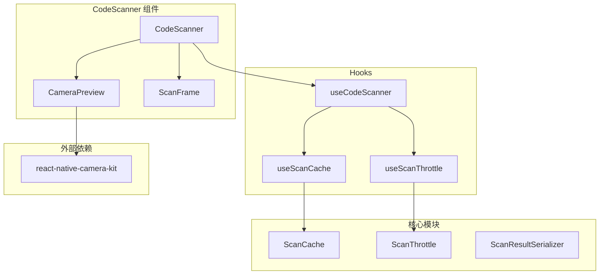

# 设计文档

## 概述

CodeScanner 是一个基于 `react-native-camera-kit` 的 React Native 扫码组件，提供二维码和条形码扫描功能。组件采用模块化设计，将核心扫码逻辑、缓存管理、时间间隔控制分离为独立模块，便于测试和维护。

## 架构



## 组件和接口

### 1. ScanResult 接口

```typescript
interface ScanResult {
  /** 扫描到的码值 */
  value: string;
  /** 码类型 (qr, ean13, code128 等) */
  codeType: string;
  /** 扫描时间戳 */
  timestamp: number;
}
```

### 2. ScanCache 类

```typescript
interface ScanCacheConfig {
  /** 缓存最大容量，默认 100 */
  maxSize: number;
  /** 缓存过期时间（毫秒），默认 5 分钟 */
  expirationMs: number;
}

interface CacheEntry {
  value: string;
  timestamp: number;
}

class ScanCache {
  constructor(config?: Partial<ScanCacheConfig>);

  /** 检查码值是否在缓存中且未过期 */
  has(value: string): boolean;

  /** 添加码值到缓存 */
  add(value: string): void;

  /** 清除所有缓存 */
  clear(): void;

  /** 获取缓存大小 */
  size(): number;

  /** 序列化缓存为 JSON */
  toJSON(): string;

  /** 从 JSON 恢复缓存 */
  static fromJSON(json: string): ScanCache;
}
```

### 3. ScanThrottle 类

```typescript
class ScanThrottle {
  constructor(intervalMs: number);

  /** 检查是否可以执行扫码 */
  canScan(): boolean;

  /** 记录一次扫码 */
  recordScan(): void;

  /** 重置节流状态 */
  reset(): void;

  /** 获取距离下次可扫码的剩余时间 */
  getRemainingTime(): number;
}
```

### 4. ScanResultSerializer 类

```typescript
interface SerializationResult<T> {
  success: boolean;
  data?: T;
  error?: string;
}

class ScanResultSerializer {
  /** 序列化 ScanResult 为 JSON 字符串 */
  static serialize(result: ScanResult): string;

  /** 反序列化 JSON 字符串为 ScanResult */
  static deserialize(json: string): SerializationResult<ScanResult>;

  /** 序列化 ScanResult 数组 */
  static serializeArray(results: ScanResult[]): string;

  /** 反序列化 JSON 字符串为 ScanResult 数组 */
  static deserializeArray(json: string): SerializationResult<ScanResult[]>;
}
```

### 5. CodeScanner 组件 Props

```typescript
interface CodeScannerProps {
  /** 扫码成功回调 */
  onScan: (result: ScanResult) => void;

  /** 重复扫码回调 */
  onDuplicateScan?: (result: ScanResult) => void;

  /** 相机权限被拒绝回调 */
  onPermissionDenied?: () => void;

  /** 扫码时间间隔（毫秒），默认 1000 */
  scanInterval?: number;

  /** 是否启用重复检测，默认 true */
  enableDuplicateDetection?: boolean;

  /** 重复扫码时是否仍触发 onScan，默认 false */
  allowDuplicateScan?: boolean;

  /** 缓存配置 */
  cacheConfig?: Partial<ScanCacheConfig>;

  /** 是否暂停扫码，默认 false */
  paused?: boolean;

  /** 手电筒模式 */
  torchMode?: 'on' | 'off' | 'auto';

  /** 是否显示扫描框，默认 true */
  showScanFrame?: boolean;

  /** 扫描框样式 */
  scanFrameStyle?: ViewStyle;

  /** 容器样式 */
  style?: ViewStyle;
}
```

### 6. useCodeScanner Hook

```typescript
interface UseCodeScannerOptions {
  scanInterval?: number;
  cacheConfig?: Partial<ScanCacheConfig>;
  enableDuplicateDetection?: boolean;
}

interface UseCodeScannerReturn {
  /** 处理扫码结果 */
  handleScan: (value: string, codeType: string) => ScanResult | null;

  /** 检查是否为重复扫码 */
  isDuplicate: (value: string) => boolean;

  /** 清除缓存 */
  clearCache: () => void;

  /** 重置节流 */
  resetThrottle: () => void;

  /** 是否可以扫码 */
  canScan: boolean;
}

function useCodeScanner(options?: UseCodeScannerOptions): UseCodeScannerReturn;
```

## 数据模型

### CacheEntry

| 字段      | 类型   | 描述               |
| --------- | ------ | ------------------ |
| value     | string | 缓存的码值         |
| timestamp | number | 添加到缓存的时间戳 |

### ScanResult

| 字段      | 类型   | 描述         |
| --------- | ------ | ------------ |
| value     | string | 扫描到的码值 |
| codeType  | string | 码类型标识   |
| timestamp | number | 扫描时间戳   |

## 正确性属性

_属性是指在系统所有有效执行中都应保持为真的特征或行为——本质上是关于系统应该做什么的形式化陈述。属性是人类可读规范与机器可验证正确性保证之间的桥梁。_

### 属性 1: ScanResult 构造完整性

*对于任意*扫码事件（包含码值和码类型），构造的 ScanResult 必须包含原始码值、原始码类型和有效时间戳。

**验证: 需求 1.2**

### 属性 2: 节流间隔强制执行

*对于任意*具有正数间隔的 ScanThrottle，在记录一次扫码后立即调用 canScan() 必须返回 false，在间隔时间过后 canScan() 必须返回 true。

**验证: 需求 2.1, 2.2**

### 属性 3: 缓存查找一致性

_对于任意_ ScanCache 和任意码值，在将该值添加到缓存后，has() 必须对该值返回 true（在过期之前）。

**验证: 需求 3.1**

### 属性 4: 缓存 FIFO 驱逐

*对于任意*最大容量为 N 的 ScanCache，在添加 N+1 个不同的值后，第一个添加的值必须不再在缓存中，且缓存大小必须等于 N。

**验证: 需求 3.4**

### 属性 5: 缓存过期

*对于任意*过期时间为 T 的 ScanCache 和任意缓存值，在该值添加后经过时间 T，has() 必须对该值返回 false。

**验证: 需求 4.3**

### 属性 6: 缓存清除

*对于任意*包含条目的 ScanCache，在调用 clear() 后，size() 必须返回 0，且 has() 必须对所有之前缓存的值返回 false。

**验证: 需求 4.4**

### 属性 7: ScanResult 序列化往返

*对于任意*有效的 ScanResult，序列化为 JSON 然后反序列化必须产生一个等价的 ScanResult，具有相同的 value、codeType 和 timestamp。

**验证: 需求 6.1, 6.2**

### 属性 8: 无效 JSON 反序列化错误

*对于任意*不是有效 JSON 或不符合 ScanResult 模式的字符串，deserialize() 必须返回 success=false 和非空错误消息的结果。

**验证: 需求 6.3**

## 错误处理

### 相机权限错误

- 当相机权限被拒绝时，组件调用 `onPermissionDenied` 回调
- 显示友好的权限提示信息

### 序列化错误

- 反序列化无效 JSON 时返回 `SerializationResult` 对象，包含 `success: false` 和错误信息
- 不抛出异常，由调用方决定如何处理

### 缓存错误

- 缓存操作不抛出异常
- 无效的 JSON 恢复缓存时返回空缓存

## 测试策略

### 属性测试

使用 `fast-check` 库进行属性测试（项目已安装）。

**测试配置：**

- 每个属性测试运行至少 100 次迭代
- 使用 `fc.assert` 进行断言

**属性测试覆盖：**

1. **ScanResult 构造测试** - 验证属性 1
2. **节流器测试** - 验证属性 2
3. **缓存查找测试** - 验证属性 3
4. **FIFO 驱逐测试** - 验证属性 4
5. **缓存过期测试** - 验证属性 5
6. **缓存清除测试** - 验证属性 6
7. **序列化往返测试** - 验证属性 7
8. **无效 JSON 测试** - 验证属性 8

### 单元测试

使用 Jest 进行单元测试。

**单元测试覆盖：**

1. **ScanCache 默认配置** - 验证默认 maxSize 和 expirationMs
2. **ScanThrottle 零间隔** - 验证 interval=0 时始终允许扫码
3. **组件 Props 默认值** - 验证组件默认配置

### 测试文件结构

```
src/components/CodeScanner/
├── __tests__/
│   ├── ScanCache.test.ts
│   ├── ScanCache.property.test.ts
│   ├── ScanThrottle.test.ts
│   ├── ScanThrottle.property.test.ts
│   ├── ScanResultSerializer.test.ts
│   └── ScanResultSerializer.property.test.ts
├── index.tsx
├── ScanCache.ts
├── ScanThrottle.ts
├── ScanResultSerializer.ts
├── types.ts
└── useCodeScanner.ts
```
