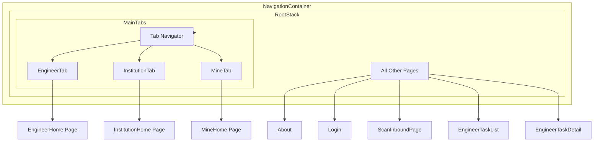

# Design Document: Cross-Module Navigation

## Overview

本设计文档描述如何重构 React Native 应用的路由架构，实现跨模块页面跳转功能。核心思路是将当前的嵌套 Navigator 模式改为 Root Stack + Tab Navigator 的混合模式，所有页面注册在全局 Root Stack 中，Tab Navigator 仅作为首页入口。

## Architecture

### 当前架构问题

```
NavigationContainer
└── Tab.Navigator
    ├── EngineerStack.Navigator (独立 Stack，只包含 Engineer 模块页面)
    ├── InstitutionStack.Navigator (独立 Stack，只包含 Institution 模块页面)
    └── MineStack.Navigator (独立 Stack，只包含 Mine 模块页面)
```

问题：每个 Tab 下的 Stack Navigator 相互隔离，无法跨模块跳转。

### 新架构设计

```
NavigationContainer
└── RootStack.Navigator (包含所有页面)
    ├── MainTabs (Tab.Navigator 作为一个 Screen)
    │   ├── EngineerTab → EngineerHome
    │   ├── InstitutionTab → InstitutionHome
    │   └── MineTab → MineHome
    ├── About (Mine 模块)
    ├── Login (Mine 模块)
    ├── ScanInboundPage (Institution 模块)
    ├── EngineerTaskList (Engineer 模块)
    ├── EngineerTaskDetail (Engineer 模块)
    └── ... (所有其他页面)
```

关键改变：

1. Tab Navigator 降级为 Root Stack 的一个 Screen
2. 所有非首页页面直接注册在 Root Stack 中
3. 导航时直接使用 Root Stack 的 navigation.navigate()

### 架构图



## Components and Interfaces

### 1. Route Configuration Interface

```typescript
// src/routers/types.ts

/**
 * 统一的路由配置项接口
 */
export interface IRouteConfig {
  name: keyof IAllRoutesParamList;
  component: ComponentType<any>;
  options?: NativeStackNavigationOptions;
  /** 是否为 Tab 首页（不注册到 Root Stack） */
  isTabHome?: boolean;
}

/**
 * 模块路由配置接口
 */
export interface IModuleRoutes {
  /** 模块名称 */
  moduleName: string;
  /** 该模块的所有路由 */
  routes: IRouteConfig[];
  /** 模块默认导航选项 */
  defaultOptions?: NativeStackNavigationOptions;
}
```

### 2. Route Aggregation

```typescript
// src/routers/index.tsx

/**
 * 聚合所有模块的路由配置
 * 过滤掉 Tab 首页，只返回需要注册到 Root Stack 的页面
 */
export function getAllRoutes(): IRouteConfig[] {
  const allModuleRoutes = [...engineerRoutes, ...institutionRoutes, ...mineRoutes];

  // 过滤掉 Tab 首页
  return allModuleRoutes.filter((route) => !route.isTabHome);
}

/**
 * 获取各模块的首页配置（用于 Tab Navigator）
 */
export function getTabHomeRoutes(): Record<string, IRouteConfig> {
  return {
    engineer: engineerRoutes.find((r) => r.isTabHome),
    institution: institutionRoutes.find((r) => r.isTabHome),
    mine: mineRoutes.find((r) => r.isTabHome),
  };
}
```

### 3. Navigation Helper

```typescript
// src/routers/navigation.ts

import { createNavigationContainerRef } from '@react-navigation/native';

/**
 * 全局导航引用，支持在组件外部进行导航
 */
export const navigationRef = createNavigationContainerRef<IAllRoutesParamList>();

/**
 * 类型安全的导航函数
 */
export function navigateTo<T extends keyof IAllRoutesParamList>(
  routeName: T,
  params?: IAllRoutesParamList[T],
): void {
  if (navigationRef.isReady()) {
    navigationRef.navigate(routeName, params);
  }
}

/**
 * 返回上一页
 */
export function goBack(): void {
  if (navigationRef.isReady() && navigationRef.canGoBack()) {
    navigationRef.goBack();
  }
}

/**
 * 重置导航栈到指定页面
 */
export function resetTo<T extends keyof IAllRoutesParamList>(
  routeName: T,
  params?: IAllRoutesParamList[T],
): void {
  if (navigationRef.isReady()) {
    navigationRef.reset({
      index: 0,
      routes: [{ name: routeName, params }],
    });
  }
}
```

### 4. App Entry Component

```typescript
// src/app/index.tsx

const RootStack = createNativeStackNavigator<IRootStackParamList>();

const App = (): React.JSX.Element => {
  const allRoutes = getAllRoutes();

  return (
    <ErrorBoundary>
      <ThemeProvider>
        <NavigationContainer ref={navigationRef}>
          <RootStack.Navigator screenOptions={defaultScreenOptions}>
            {/* Tab Navigator 作为一个 Screen */}
            <RootStack.Screen
              name='MainTabs'
              component={MainTabsScreen}
              options={{ headerShown: false }}
            />

            {/* 动态注册所有其他页面 */}
            {allRoutes.map((route) => (
              <RootStack.Screen
                key={route.name}
                name={route.name}
                component={route.component}
                options={route.options}
              />
            ))}
          </RootStack.Navigator>
        </NavigationContainer>
      </ThemeProvider>
    </ErrorBoundary>
  );
};
```

### 5. MainTabs Component

```typescript
// src/app/MainTabs.tsx

const Tab = createBottomTabNavigator<TMainTabParamList>();

const MainTabsScreen = (): React.JSX.Element => {
  const { role } = useUserStore();
  const tabs = getTabsByRole(role);
  const tabHomeRoutes = getTabHomeRoutes();

  return (
    <Tab.Navigator screenOptions={defaultTabScreenOptions}>
      {tabs.map((tab) => {
        const homeRoute = tabHomeRoutes[tab.moduleKey];
        return (
          <Tab.Screen
            key={tab.name}
            name={tab.name}
            component={homeRoute.component}
            options={{
              tabBarLabel: tab.label,
              tabBarIcon: ({ color }) => (
                <Text style={[styles.tabIcon, { color }]}>{tab.icon}</Text>
              ),
            }}
          />
        );
      })}
    </Tab.Navigator>
  );
};
```

## Data Models

### Route Parameter Types

```typescript
// src/routers/types.ts

// Root Stack 参数（包含 MainTabs 和所有页面）
export interface IRootStackParamList {
  MainTabs: undefined;
  // Engineer 模块页面
  EngineerTaskList: { status?: 'pending' | 'completed' };
  EngineerTaskDetail: { taskId: string };
  EngineerProfile: undefined;
  // Institution 模块页面
  InstitutionList: { filter?: string };
  InstitutionDetail: { institutionId: string };
  InstitutionSettings: undefined;
  ScanInboundPage: { scanType?: 'inbound' | 'outbound' };
  // Mine 模块页面
  About: undefined;
  Login: undefined;
  MineProfile: undefined;
  MineSettings: undefined;
  [key: string]: object | undefined;
}

// Tab 参数
export interface IMainTabParamList {
  EngineerTab: undefined;
  InstitutionTab: undefined;
  MineTab: undefined;
  [key: string]: object | undefined;
}

// 合并类型（用于类型安全导航）
export type IAllRoutesParamList = IRootStackParamList & IMainTabParamList;
```

### Tab Configuration

```typescript
// src/app/types.ts

export interface ITabConfig {
  name: keyof IMainTabParamList;
  label: string;
  icon: string;
  /** 对应的模块 key，用于查找首页组件 */
  moduleKey: 'engineer' | 'institution' | 'mine';
}
```

## Correctness Properties

_A property is a characteristic or behavior that should hold true across all valid executions of a system-essentially, a formal statement about what the system should do. Properties serve as the bridge between human-readable specifications and machine-verifiable correctness guarantees._

### Property 1: Cross-module navigation succeeds

_For any_ source page and target page combination where both are registered routes, navigation from source to target SHALL succeed and display the target page.
**Validates: Requirements 1.1**

### Property 2: Navigation history integrity

_For any_ sequence of navigation actions, the navigation history stack SHALL contain entries in the correct order matching the navigation sequence.
**Validates: Requirements 1.2**

### Property 3: Back navigation round-trip

_For any_ navigation from page A to page B, pressing back SHALL return to page A, regardless of whether A and B belong to different modules.
**Validates: Requirements 1.3**

### Property 4: Route aggregation completeness

_For any_ route defined in any module's route configuration, that route SHALL be present in the aggregated route list returned by getAllRoutes() (excluding tab home pages).
**Validates: Requirements 2.2**

### Property 5: Tab bar visibility during navigation

_For any_ page displayed via Root Stack navigation (non-tab pages), the tab bar SHALL be hidden, and for MainTabs screen, the tab bar SHALL be visible.
**Validates: Requirements 3.2**

## Error Handling

### Navigation Errors

1. **Route Not Found**: 如果导航到未注册的路由，React Navigation 会抛出错误。通过 TypeScript 类型检查在编译时捕获。

2. **Navigation Before Ready**: `navigationRef.isReady()` 检查确保导航容器已初始化。

3. **Invalid Parameters**: TypeScript 泛型约束确保参数类型正确。

### Fallback Strategies

```typescript
export function safeNavigate<T extends keyof IAllRoutesParamList>(
  routeName: T,
  params?: IAllRoutesParamList[T],
): boolean {
  try {
    if (!navigationRef.isReady()) {
      console.warn('Navigation not ready');
      return false;
    }
    navigationRef.navigate(routeName, params);
    return true;
  } catch (error) {
    console.error('Navigation failed:', error);
    return false;
  }
}
```

## Testing Strategy

### Unit Testing

使用 Jest 进行单元测试：

1. **Route Aggregation Tests**: 验证 `getAllRoutes()` 正确聚合所有模块路由
2. **Tab Config Tests**: 验证 `getTabsByRole()` 返回正确的 Tab 配置
3. **Navigation Helper Tests**: 验证导航函数的行为

### Property-Based Testing

使用 `fast-check` 进行属性测试：

1. **Route Completeness Property**: 生成随机模块路由配置，验证聚合结果包含所有非首页路由
2. **Navigation Round-trip Property**: 生成随机导航序列，验证返回操作正确恢复状态

### Integration Testing

使用 React Native Testing Library：

1. **Cross-module Navigation**: 模拟从 MineHome 跳转到 ScanInboundPage
2. **Tab Switching**: 验证 Tab 切换正确显示对应首页
3. **Back Navigation**: 验证跨模块返回行为

### Test Configuration

```typescript
// jest.config.js 中配置 fast-check
module.exports = {
  // ... 其他配置
  setupFilesAfterEnv: ['./jest.setup.js'],
};

// 每个属性测试运行 100 次迭代
fc.configureGlobal({ numRuns: 100 });
```
