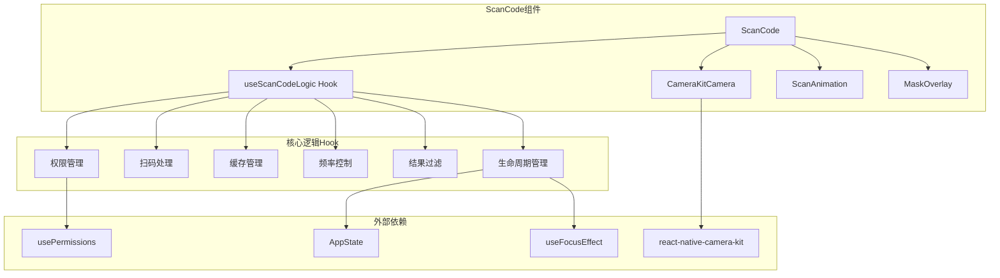
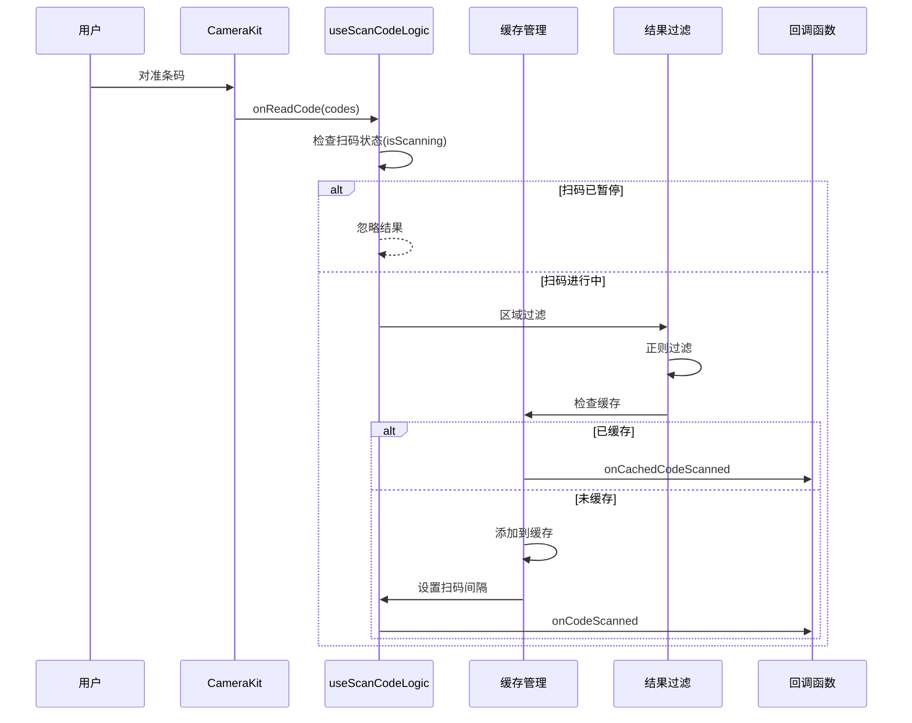

# 设计文档

## 概述

本设计文档描述了基于 `react-native-camera-kit` 库实现的 ScanCode 扫码组件的技术架构和实现方案。该组件采用 React Hooks 函数式组件设计，提供完整的扫码能力，包括多格式条码识别、区域限制、结果过滤、缓存管理和频率控制等功能。

## 架构

### 整体架构图



### 数据流图



## 组件和接口

### 1. ScanCode 主组件

```typescript
interface IScanCodeProps {
  // 基础配置
  style?: StyleProp<ViewStyle>;
  codeTypes?: CodeType[];
  
  // 生命周期控制
  isActive?: boolean;              // 控制组件是否激活，默认 true
  pauseOnBlur?: boolean;           // 页面失焦时是否暂停，默认 true
  pauseOnBackground?: boolean;     // 应用进入后台时是否暂停，默认 true
  
  // 扫码区域
  scanArea?: IScanArea;
  needLimitArea?: boolean;
  maskColor?: string;
  
  // 过滤配置
  includePatterns?: RegExp[];
  excludePatterns?: RegExp[];
  
  // 缓存配置
  enableCache?: boolean;
  cacheTimeout?: number;
  
  // 频率控制
  scanInterval?: number;
  scanTimeout?: number;
  
  // 反馈配置
  enableVibration?: boolean;
  enableFlashlight?: boolean;
  showScanAnimation?: boolean;
  
  // 回调函数
  onCodeScanned?: (result: IScanResult) => void;
  onMultipleCodesScanned?: (results: IScanResult[]) => void;
  onCachedCodeScanned?: (result: IScanResult) => void;
  onScanTimeout?: () => void;
  onCameraPermissionDenied?: () => void;
  onCameraError?: (error: Error) => void;
  
  // 子组件
  children?: React.ReactNode;
}
```

### 2. useScanCodeLogic Hook

```typescript
interface IUseScanCodeLogicOptions {
  codeTypes: CodeType[];
  scanArea?: IScanArea;
  needLimitArea: boolean;
  includePatterns: RegExp[];
  excludePatterns: RegExp[];
  enableCache: boolean;
  cacheTimeout: number;
  scanInterval: number;
  scanTimeout?: number;
  enableVibration: boolean;
  onCodeScanned?: (result: IScanResult) => void;
  onMultipleCodesScanned?: (results: IScanResult[]) => void;
  onCachedCodeScanned?: (result: IScanResult) => void;
  onScanTimeout?: () => void;
}

interface IUseScanCodeLogicReturn {
  // 状态
  isScanning: boolean;
  flashlightOn: boolean;
  
  // 方法
  handleCodeRead: (codes: ICodeReadEvent[]) => void;
  pauseScanning: () => void;
  resumeScanning: () => void;
  toggleFlashlight: () => void;
  clearCache: () => void;
  removeFromCache: (code: string) => void;
  
  // 清理
  cleanup: () => void;
}
```

### 3. 类型定义

```typescript
// 支持的条码类型
type CodeType = 
  | 'qr'
  | 'ean-13'
  | 'ean-8'
  | 'code-128'
  | 'code-39'
  | 'code-93'
  | 'upc-a'
  | 'upc-e'
  | 'pdf417'
  | 'codabar';

// 扫描区域配置
interface IScanArea {
  width: number;
  height: number;
  topOffset: number;
}

// 扫码结果
interface IScanResult {
  data: string;
  type: CodeType;
  timestamp: number;
  bounds?: {
    top: number;
    left: number;
    width: number;
    height: number;
  };
}

// CameraKit 原始事件
interface ICodeReadEvent {
  nativeEvent: {
    codeStringValue: string;
    codeFormat: string;
    // 位置信息（如果可用）
    bounds?: {
      origin: { x: number; y: number };
      size: { width: number; height: number };
    };
  };
}
```

## 数据模型

### 缓存数据结构

```typescript
interface ICacheEntry {
  code: string;
  timestamp: number;
  timerId: NodeJS.Timeout;
}

// 使用 Map 存储缓存，key 为条码内容
type CodeCache = Map<string, ICacheEntry>;
```

### 组件状态

```typescript
interface IScanCodeState {
  hasPermission: boolean;
  isScanning: boolean;
  flashlightOn: boolean;
  animationStarted: boolean;
  isCameraActive: boolean;    // 相机是否激活
  appState: 'active' | 'background' | 'inactive';  // 应用状态
}
```

### 生命周期管理

组件通过以下机制管理扫码功能的生命周期：

1. **页面焦点监听** - 使用 `useFocusEffect` 监听页面焦点变化
2. **应用状态监听** - 使用 `AppState` 监听应用前后台切换
3. **isActive 属性** - 允许父组件直接控制扫码功能的激活状态

```typescript
// 生命周期状态机
type LifecycleState = 'active' | 'paused_blur' | 'paused_background' | 'paused_inactive';

// 状态转换规则
// active -> paused_blur: 页面失去焦点
// active -> paused_background: 应用进入后台
// active -> paused_inactive: isActive 变为 false
// paused_* -> active: 对应条件恢复
```


## 正确性属性

*属性是系统在所有有效执行中应保持为真的特征或行为——本质上是关于系统应该做什么的形式化陈述。属性作为人类可读规范和机器可验证正确性保证之间的桥梁。*

### 属性 1: 区域过滤正确性
*对于任意*扫描区域配置和任意条码位置集合，当 needLimitArea 为 true 时，过滤后的结果应仅包含位置在扫描区域内的条码
**验证: 需求 3.1, 3.2**

### 属性 2: 区域排序正确性
*对于任意*扫描区域和任意多个条码位置，排序后的结果应按照与扫描区域中心点的欧几里得距离从小到大排列
**验证: 需求 3.3**

### 属性 3: 包含正则过滤正确性
*对于任意*条码数据集合和任意 includePatterns 正则数组，过滤后的结果中每个条码都应至少匹配一个包含正则
**验证: 需求 4.1**

### 属性 4: 排除正则过滤正确性
*对于任意*条码数据集合和任意 excludePatterns 正则数组，过滤后的结果中不应包含任何匹配排除正则的条码
**验证: 需求 4.2**

### 属性 5: 缓存添加正确性
*对于任意*条码，扫描成功后该条码应存在于缓存中
**验证: 需求 5.1**

### 属性 6: 缓存命中回调正确性
*对于任意*已缓存的条码，再次扫描时应调用 onCachedCodeScanned 回调而非 onCodeScanned 回调
**验证: 需求 5.2**

### 属性 7: 缓存清空正确性
*对于任意*缓存状态，调用 clearCache 后缓存应为空
**验证: 需求 5.4**

### 属性 8: 缓存移除正确性
*对于任意*缓存中的条码集合，调用 removeFromCache(code) 后，该条码应不在缓存中，其他条码应保持不变
**验证: 需求 5.5**

### 属性 9: 闪光灯切换正确性
*对于任意*闪光灯初始状态，调用 toggleFlashlight 后状态应取反
**验证: 需求 7.4**

### 属性 10: 扫码结果完整性
*对于任意*成功的扫码事件，onCodeScanned 回调的参数应包含 data、type、timestamp 三个必需字段
**验证: 需求 8.1**

### 属性 11: 条码类型配置传递正确性
*对于任意* codeTypes 配置，组件应将其正确转换并传递给底层相机组件
**验证: 需求 2.2**

### 属性 12: 页面焦点状态同步正确性
*对于任意*页面焦点状态变化，当 pauseOnBlur 为 true 时，扫码状态应与页面焦点状态保持同步（焦点时扫码，失焦时暂停）
**验证: 需求 10.1, 10.2**

### 属性 13: 应用状态同步正确性
*对于任意*应用前后台状态变化，当 pauseOnBackground 为 true 时，扫码状态应与应用状态保持同步（前台时扫码，后台时暂停）
**验证: 需求 10.3, 10.4**

### 属性 14: isActive 属性控制正确性
*对于任意* isActive 属性值，相机激活状态应与 isActive 值保持一致
**验证: 需求 10.5, 10.6**

## 错误处理

### 权限错误
- 相机权限被拒绝时，调用 `onCameraPermissionDenied` 回调
- 权限状态为 `blocked` 时，可引导用户前往设置页面

### 相机错误
- 相机初始化失败时，调用 `onCameraError` 回调并传递错误信息
- 支持自动重试机制（最多重试 2 次）

### 扫码超时
- 当设置了 `scanTimeout` 且在指定时间内未扫描到有效条码时，调用 `onScanTimeout` 回调

### 边界情况
- 空条码数据：忽略并不触发回调
- 无效条码格式：过滤掉不在 `codeTypes` 中的格式
- 组件卸载时的异步操作：使用 ref 标记组件是否已卸载，避免状态更新
- 快速切换前后台：使用防抖机制避免频繁切换状态
- 页面快速切换：确保状态监听器正确清理和重建

## 测试策略

### 单元测试

使用 Jest 进行单元测试，覆盖以下场景：

1. **过滤逻辑测试**
   - 区域过滤函数 `filterByArea`
   - 正则过滤函数 `filterByPatterns`
   - 排序函数 `sortByDistance`

2. **缓存管理测试**
   - 添加、移除、清空缓存
   - 超时自动清除

3. **状态管理测试**
   - 扫码暂停/恢复
   - 闪光灯切换

4. **生命周期管理测试**
   - 页面焦点变化响应
   - 应用前后台切换响应
   - isActive 属性变化响应

### 属性测试

使用 `fast-check` 进行属性测试，验证核心逻辑的正确性：

1. **区域过滤属性测试** - 验证属性 1, 2
2. **正则过滤属性测试** - 验证属性 3, 4
3. **缓存管理属性测试** - 验证属性 5, 6, 7, 8
4. **状态切换属性测试** - 验证属性 9
5. **结果完整性属性测试** - 验证属性 10
6. **生命周期状态属性测试** - 验证属性 12, 13, 14

### 测试框架配置

- 单元测试框架：Jest
- 属性测试库：fast-check（项目已安装）
- Mock 库：Jest 内置 mock 功能

### 测试文件结构

```
src/components/ScanCode/
├── __tests__/
│   ├── ScanCode.test.tsx          # 组件单元测试
│   ├── useScanCodeLogic.test.ts   # Hook 单元测试
│   ├── filterUtils.test.ts        # 过滤工具函数测试
│   ├── filterUtils.property.test.ts  # 过滤函数属性测试
│   └── cacheManager.property.test.ts # 缓存管理属性测试
```
